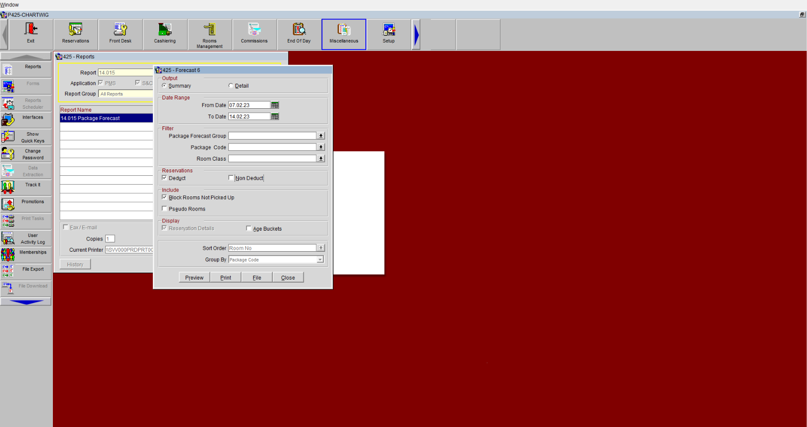
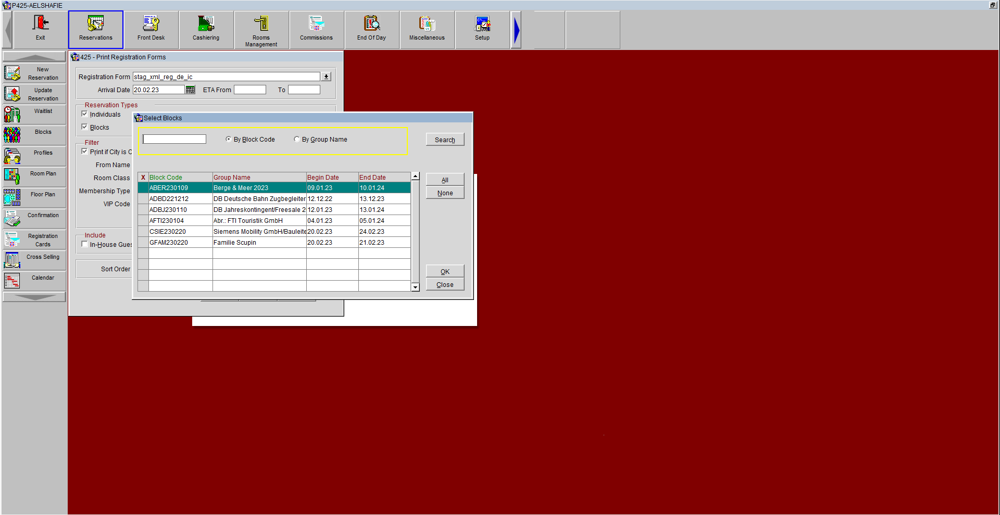
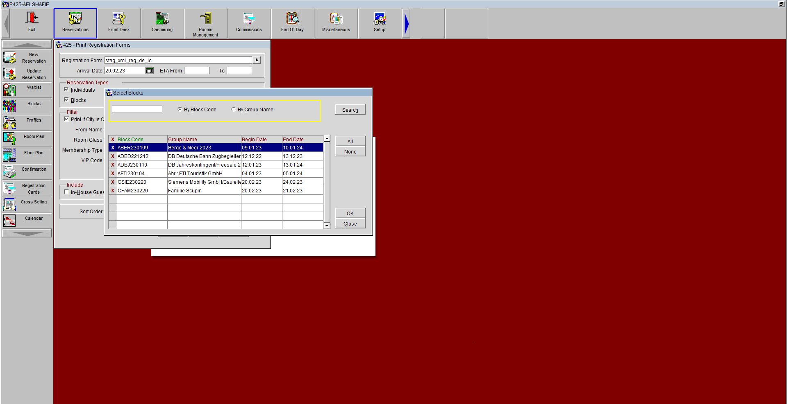

### Table Of Content
- [Before End Of Day](#before-end-of-day)
   - [Breakfast List *Kitchen*](#breakfast-list-kitchen)
   - [Extending PM Night's](#extending-pm-nights)
   - [Canceling 6pm Guests](#canceling-6pm-guests)
- [Preparation End Of Day](#preparation-end-of-day)
  - [Note down ALL *No Show* Guests](#note-down-all-no-show-guests)
  - [Reports](#reports)
    - [Journal By Cashier and Creditcards *Kiosk*](#journal-by-cashier-and-creditcards-kiosk)
    - [Upgrade Reason](#upgrade-reason)
    - [Closing Account 9999 *Restaurant*](#closing-account-9999-restaurant)
    - [User Activity Log](#user-activity-log)
    - [Credit Cards Reports](#credit-cards-reports)
    - [Journal By Creditcards](#journal-by-creditcards)
    - [Count Physical Cash](#count-physical-cash)
    - [Cashier Shift Closure](#cashier-shift-closure)
    - [Journal By Manual Credit Cards](#journal-by-manual-credit-cards)
    - [Excel Table \& Credit Card Control](#excel-table--credit-card-control)
    - [Negative Posting](#negative-posting)
    - [Negative Posting by Cashier](#negative-posting-by-cashier)
- [End Of Day](#end-of-day)
- [Order Of End Of Day Folder](#order-of-end-of-day-folder)
  - [End Of Day *Slide*](#end-of-day-slide)
      - [Negative Posting *Slide*](#negative-posting-slide)
      - [CC Kontrolle *Slide*](#cc-kontrolle-slide)
      - [No Show *Slide*](#no-show-slide)
      - [**Cashier Closure**](#cashier-closure)
      - [**Credit Cards By Name**](#credit-cards-by-name)
      - [**Pre Payment Website**](#pre-payment-website)
      - [**Pre Payment Website (Amex)**](#pre-payment-website-amex)
      - [**Pre Payment Website (PayPal)**](#pre-payment-website-paypal)
      - [**Paidout**](#paidout)
      - [**Voucher**](#voucher)
      - [**City Ledger**](#city-ledger)
- [After End Of Day](#after-end-of-day)
  - [Breakfast List for Service](#breakfast-list-for-service)
  - [From 6 O'Clock](#from-6-oclock)
    - [Traces FO Status *For FO*](#traces-fo-status-for-fo)
    - [Housekeeping List](#housekeeping-list)
<!-- vscode-markdown-toc-config
	numbering=true
	autoSave=true
	/vscode-markdown-toc-config -->
<!-- /vscode-markdown-toc -->

## Before End Of Day
### Breakfast List *Kitchen*
  - **14.015**
       - *Miscellaneous* > *Reports* > *In Report type* > **14.015** > *Search* > *Under Report Name double click* **14.015 Package Forecast** > *uncheck Non Deduct* > *Print*

### Extending PM Night's
  - *Front Desk* > *In House Guests* > *Advanced* > *Under Search Type Check* **Due Out**  > *Search* > *in each found PM*
       - *double click PM* > *in Nights extend nights AMAP* > *Ok*
  [[1]](#Note1)

### Canceling 6PM Guests
  - *Front Desk* > *Arrivals* > *Search* > *Find Guests with 6pm Status* > *One Click on Guest Name* > *Cancel*
       - *Answer of the Question Reason?* > *Not Guaranteed*
  [[2]](#Note2) [[3]](#Note3)
### Registeration Cards

  - *Reservations* > *Registeration Cards* > *Under Reservation Types Check*
    - *Individuals*
    - *Blocks* 
      - *Arrow Down In Block* > *Click All* > *Click OK* > *Print*
  [[4]](#Note4)

<a href="#top">Back to top</a>

## Preparation End Of Day
### Note down ALL *No Show* Guests
   - *Write down all Rates of unarrived Guests before End Of Day*[[5]](#Note5)
### Reports
#### Journal By Cashier and Creditcards *Kiosk*
   - *Miscellaneous* > *Reports* > *Report* > **12.029b** > *Search* > *in Report Name double click Journal By Cashier and Creditcards* > *in Transaction Code* > *Description* > *type %KIOSK*  > *Select All*  > *Print*
#### Upgrade Reason
   - *Miscellaneous* > *Reports* > *Report* > **24.053a** > *Print*
#### Closing Account 9999 *Restaurant*
   - *Cashiering* > *Billing* > *type log In Data* > *search Room 9999* > *double click Room 9999* > *Check out*
#### User Activity Log
   - **12.048**
     - *Miscellaneous* > *Reports* > *Report* > **12.048** > *Search* > *in Report Name double click User Activity Log* > *in first date type yesterday's Date -1* > *in second date type yesterdays's Date -1* > *Print*
#### Credit Cards Reports
##### Journal By Creditcards
   - *Miscellaneous* > *Reports* > *Report* > *type* 
      - **425_12.029** > *Search* > *in Report Name double click* 
          - **Amex** > *Print*
          - **Mastercard** > *Print*
          - **Visa** > *Print*
          - **Cash** > *Print*
          - **VPay** > *Print*
          - **Wire Transfer** > *Print*
          - **Maestro** > *Print*
          - **City Ledger**
              - *in Transaction Codes* > *type*
                 - **952000,953000** > *Print*
                 - **952100,953100** > *Print*
                 - **952200,953200** > *Print*
                 - **800000** > *Print*
                 - **940000,940500,941000,941100** > *Print*
                 - **930000** > *Print*
#### Count Physical Cash
   - Count Physical Cash *in Front Desk* , and Use Excel Table to fill Cash[[6]](#Note6) [[7]](#Note7)
#### Cashier Shift Closure
   - *Cashiering* > *Cashier Shift Close*[[8]](#Note8)
#### Journal By Manual Credit Cards 
   - ##### **Journal by Manual Credit Cards**
     - *Miscellaneous* > *Reports* > *Report* > **12.029j** > *Search* > *in Report Name double click Journal by Manual Credit Cards* > *Print*
#### Excel Table & Credit Card Control
   - One Click Excel Icon in Desktop > Double Click CC Kontrolle
   - **X-Bericht & Z-Bericht & CC-Terminal Reciept**
   - ##### **CC-Terminal Reciept**
     - Go to the Bar and Pull out Reciept from the small Terminal
   - **X-Report & Z-Report**
     - Go to the Bar and Pull out Reciept form the IPAD
#### Negative Posting
   - *Miscellaneous* > *Reports* > **12.029f** > *Search* > *in Report Name double click Negative Posting* > *Print*
#### Negative Posting by Cashier
   - *Miscellaneous* > *Reports* > *Report* > **12.031** > *Search* > *in Report Name double click Negative Posting by Cashier* > *in Cashier* > *type* 
     - **425201** > *Print*
     - **425202** > *Print*
     - **425203** > *Print*

<a href="#top">Back to top</a>

  ## End Of Day
  - *End Of Day* > *Night Audit* > *Login*

<a href="#top">Back to top</a>

  ## Order Of End Of Day Folder
  ### End Of Day *Slide*
  - **TA - Reporting Paket**
    - Found Under Desktop 
  - **Checkliste Nachtdienst Rundgang Täglich**
    - Found Under Desktop
  - **Printed out form *END OF DAY***
    - **Intercity Hotel Braunschweig**
    - **Trail Balance**
    - **Manager Flash**
    - **Revenue By Transaction Codes Net = Revenue of The Day Net**
    - **Negative Posting by Transaction Code = Non Revenue by Transaction Code**
    - ##### **No Show**
    - **Complimentary Rooms In House**
    - **Non Revenue by Transaction Codes = Non Revenue / Paidout of the Day**
    - **Credit Limit Report**
    - **Paidouts**
    - [**User Activity Log**](#user-activity-log)
    - **Reservation Entered on And By = Reservation Made Yesterday**
  ##### Negative Posting *Slide*
  - [**Negative Posting**](#negative-posting) 
    - *firstly 425203, then 425202 and lastly 425203*
  ##### CC Kontrolle *Slide*
  - [**Journal By Cashier and Creditcards Kiosk**](#journal-by-cashier-and-creditcards-kiosk)
  - [**Journal By Manual Credit Cards**](#journal-by-manual-credit-cards)
  - [**Excel**](#excel-table--credit-card-control)
  - [**Terminal Reciept**](#cc-terminal-reciept)
  ##### No Show *Slide*
  - [**No Show**](#no-show)
  - [**Upgrade Reason**](#upgrade-reason)
  ##### [**Cashier Closure**](#cashier-shift-closure) 
  - *In Following : Night,Late,Morning and at the End of Each [Count Physical Cash](#count-physical-cash)*
  - *Cashier Shift Close of Late and Morning Shift are found in Desk Paper Storage in Wilkon Desk*
  ##### **Credit Cards By Name**
  - [**Amex**](#credit-cards-reports)
    - *Then Collected Amex Invoices from Desk Paper Storage in Wilkon Desk*
  - [**Mastercard**](#credit-cards-reports)
    - *Then Collected MasterCardInvoices from Desk Paper Storage in Wilkon Desk*
  - [**Visa**](#credit-cards-reports)
    - *Then Collected VISAInvoices from Desk Paper Storage in Wilkon Desk*
  - [**Cash**](#credit-cards-reports)
    - *Then Collected CASH Invoices from Desk Paper Storage in Wilkon Desk*
    - *Then [Closing Account 9999 Restaurant](#closing-account-9999-restaurant)*
  - [**VPAY**](#credit-cards-reports)
    - *Then Collected VPAY Invoices from Desk Paper Storage in Wilkon Desk*
  - [**WireTransfer**](#credit-cards-reports)
    - *Then Collected Wire Transfer Invoices from Desk Paper Storage in Wilkon Desk*
    - *Then Collected Überweisung Invoices from Desk Papar Storage in Wilkon Desk*
  - [**Maestro**](#credit-cards-reports)
    - *Then Collected Maestro Invoices from Desk Paper Storage in Wilkon Desk*
  ##### **Pre Payment Website**
  - [**952000,953000**](#credit-cards-reports)
  ##### **Pre Payment Website (Amex)**
  - [**952100,953100**](#credit-cards-reports)
  ##### **Pre Payment Website (PayPal)**
  - [**952200,953200**](#credit-cards-reports)
  ##### **Paidout**
  - [**800000**](#credit-cards-reports)
  ##### **Voucher**
  - [**940000,940500,941000,941100**](#credit-cards-reports)
  ##### **City Ledger**
  - [**930000**](#credit-cards-reports)
  - *Then Collected (bitte Überweisen Sie) Invoices from Desk Paper Storage in Wilkon Desk*

<a href="#top">Back to top</a>

  ## After End Of Day
### Breakfast List for Service
   - **15.033g**
     - *Miscellaneous* > *Reports* > *Report* > **15.033g** > *Search* > *in Report Name double click* **Breakfast List by Room ab 01.07.2020** > *arrow down In Packages* > *click All* > *Click Ok* > *Click Ok for Please note: A large number of codes have been selected!* > *Print*
### From 6 O'Clock
#### Traces FO Status *For FO*
   - **15.023e**
     - *Miscellaneous* > *Reports* > *Report* > **15.023e** > *Search* > *in Report Name double click FO Traces INH/Arrivals/Due Outs/PM* > *Print*
   - **Event List *For FO***
   - **11.005**
     - *Miscellaneous* > *Reports* > *Report* > **11.005** > *Search* > *in Report Name double click Event Listing Detailed* > *Under Date Type*
        - *Enter Today's Date , Relly Today's Date not from shift work* > *Print*
#### Housekeeping List 
   - **15.023c**
     - *Miscellaneous* > ** *Reports* > *Report* > ***15.023c** > *Search* > *in Report Name double click HSK Traces INH/Arrivals/Due Outs* > *Print*
   - **List of Room Moves** 
     - **15.031**
       - *Miscellaneous* > ** *Reports* > *Report* > ***15.031** > *Search* > *in Report Name double click Room Moves* > *Print*
     - **16.005** > *Print*
       - *Miscellaneous* > ** *Reports* > *Report* > ***16.005** > *click* Search > *in Report Name double click Housekeeping VIP'S By Room No.* > *Print* 
  - **Housekeeping Management Report**
    - **HSK Mgmt Report**
      - *Rooms Management* > *Housekeeping* > *Housekeeping Mgmt.* > *Report*
  - **Housekeeping Task Assignment**
    - **HSK Task Assignment** > *Auto* > *Ok* > *Report* > *Print*

<a href="#top">Back to top</a>

---
[1] same above-mentioned step for Each PM

[2] Mainly before  Closing Cashier

[3] ONLY if the Guest is a Self-Paying with no Credit Card

[4] There is a special Method for Printing Register Cards for Groups and ...

[5] OR take a look at the No Show report after End Of Day

[6] Cash Count should be ZERO

[7] Firstly Count Physical Cash and Then Cashier

[8] This step happenes after Counting Physical Cash